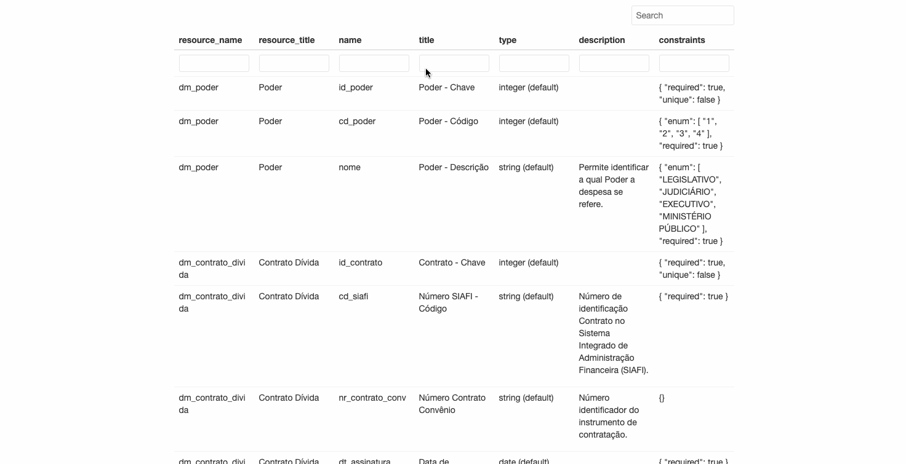

# Dicionário de dados para data package age7

## Pré-requisitos

Esse projeto utiliza o R versão 4.1.2. Faça a instalação ou atualização antes de continuar.

O pacote renv é utilizado para gerenciamento de dependências. Você pode instalar as mesmas com `renv::restore()`.

## Uso

Para gerar o dicionário de dados execute

```
make build
```


